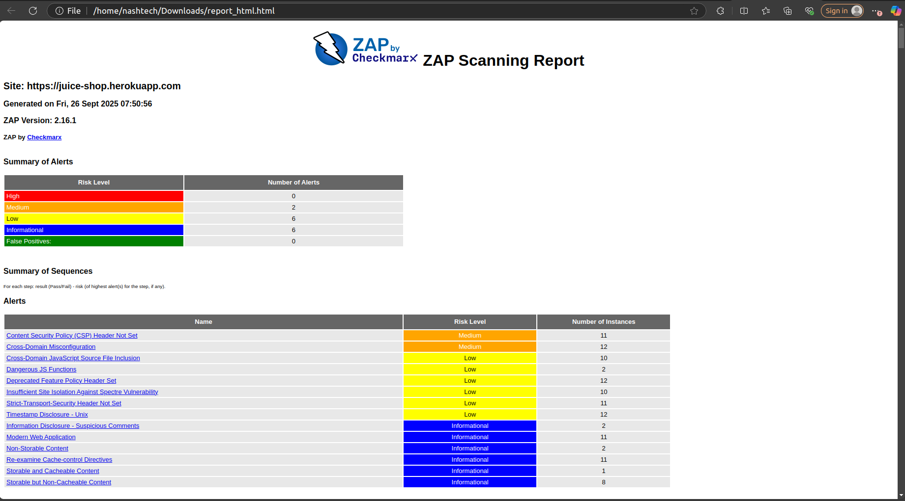

# Day 2 — OWASP ZAP: Detecting & Understanding Web Vulnerabilities

## Objective
The aim of this exercise is to connect OWASP ZAP with a deliberately insecure web application (OWASP Juice Shop) through GitHub Actions. The workflow triggers automatically on each push, runs a dynamic scan, and generates an HTML security report (zap-report.html) as an artifact. This process makes it easier for developers to spot and remedy vulnerabilities early in the development pipeline.

## Pull & run the target app (Juice Shop) locally
```bash
# pull the image (optional if you already pulled)
docker pull bkimminich/juice-shop:latest

# run the app as a background container
docker run -d --name juice -p 3000:3000 bkimminich/juice-shop:latest

# verify it is up (open in browser)
# http://localhost:3000
curl -sSf http://localhost:3000
```

---

## CI/CD Pipeline Integration

A GitHub Actions workflow (.github/workflows/OWASP_ZAP_Scan_Day2.yml) automates the OWASP ZAP security scan on every push to the master branch. It checks out the code, runs the scan against the target application, and uploads the HTML report as an artifact, ensuring security testing is seamlessly integrated into the development process.

## 1. What screenshot/report shows
Here is a screenshot of the summary section from the `ZapScanReport.html` generated by the pipeline.



In the screenshot I shared, the report summary shows:

- **High:** 0  
- **Medium:** **2**  
- **Low:** 6  
- **Informational:** 6  
- **False Positives:** 0

The two **Medium** alerts listed are:

1. **Content Security Policy (CSP) Header Not Set** — *Number of instances: 11*  
2. **Cross-Domain Misconfiguration** — *Number of instances: 12*


---

## 2. Short explanation + recommended fixes (per vulnerability)

### A. Content Security Policy (CSP) Header Not Set — **Medium**
**What it means:**  
The web app does not send a Content-Security-Policy header. Without CSP, an attacker has fewer constraints for injecting/ running malicious scripts (increases XSS risk).

**Recommended fix (high level):**
- Implement a Content-Security-Policy header appropriate for the app.
- Start with a restrictive policy and relax only as required by the app.
- Example (adapt to your resources and allowed domains):
```http
Content-Security-Policy: default-src 'self'; script-src 'self' https:; connect-src 'self' https:; img-src 'self' data: https:; object-src 'none'; base-uri 'self'; frame-ancestors 'none'; form-action 'self'; upgrade-insecure-requests;
```
**Steps:**
1. Identify which domains/scripts the app legitimately needs (CDNs, analytics, APIs).
2. Create a policy that allows only those sources.
3. Deploy as `Content-Security-Policy` header (or use `Content-Security-Policy-Report-Only` first to test).
4. Re-scan after deployment.

---

### B. Cross-Domain Misconfiguration — **Medium**
**What it means:**  
CORS or other cross-domain settings are configured too permissively (e.g., `Access-Control-Allow-Origin: *` while allowing credentials), or there’s another improper cross-domain policy that lets unintended origins interact with resources.

**Recommended fix (high level):**
- Restrict `Access-Control-Allow-Origin` to only trusted origins (do not use `*` if sending credentials).
- Explicitly set allowed headers/methods and only allow credentials when necessary.
- Example:
```http
Access-Control-Allow-Origin: https://your-frontend.example.com
Access-Control-Allow-Methods: GET, POST, OPTIONS
Access-Control-Allow-Headers: Content-Type, Authorization
Access-Control-Allow-Credentials: true   # only if truly needed
```
**Steps:**
1. Audit endpoints that return CORS headers.
2. Replace `*` with a whitelist of allowed origins.
3. Ensure the server validates `Origin` and only returns ACL headers when the origin is allowed.
4. Re-scan after changes.

---

## Core concept answers
### 1. What is the purpose of DAST and how does it complement other security testing methods?
-   DAST (Dynamic Application Security Testing) tests an application in its running state.
-   It simulates real-world attacker behavior by sending malicious requests to the app.
-   Heps identify vulnerabilities such as XSS, SQL Injection, authentication flaws, and misconfigurations.
### 2. Explain how XSS or SQL injection vulnerabilities can affect an application and its users.
-   **Cross-Site Scripting (XSS):**
    - Allows attackers to inject and execute malicious scripts in the user’s browser.
    - Can steal cookies, session tokens, or sensitive user data.
    - May lead to account hijacking, phishing attacks, or spreading malware.

-   **SQL Injection (SQLi):**
    - Exploits unsanitized input fields to run malicious SQL queries.
    - Attackers can read, modify, or delete data in the database.
    - Can bypass authentication, leading to unauthorized access.
    - May cause full data breaches and reputational loss.

### 3. Describe the steps you would take to fix the vulnerabilities detected in your ZAP scan.
-   **For SQL Injection:**
    - Use parameterized queries / prepared statements instead of string concatenation.
    - Implement strong input validation and sanitization.
    - Apply least privilege on database accounts.

-   **For XSS:**
    - Encode or escape user inputs before rendering in HTML/JS.
    - Use frameworks/libraries with built-in XSS protection.
    - Implement a strong Content Security Policy (CSP).

-   **General Fixes:**
    - Apply secure configuration (disable default accounts, enforce HTTPS).
    - Patch and update frameworks, libraries, and dependencies regularly.
    - Add proper error handling to avoid information leakage.

### 4. How does integrating ZAP scans into CI/CD pipelines support shift-left security practices?** 
-   Shift-left means integrating security earlier in the Software Development Lifecycle (SDLC).
-   Running automated ZAP scans in CI/CD ensures vulnerabilities are caught before production release.
-   Developers get fast feedback on security issues as part of build/test stages.
-   Reduces cost of fixing vulnerabilities by detecting them early.