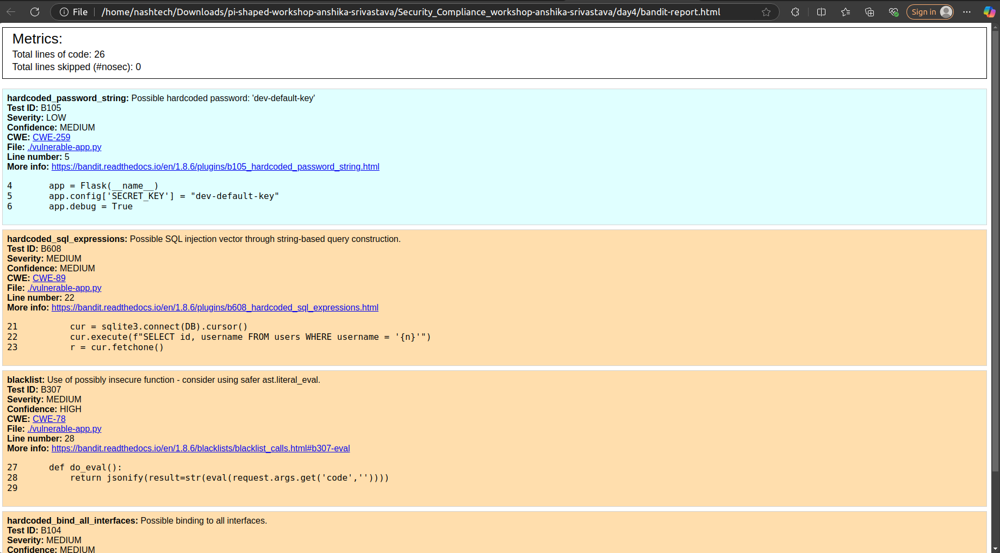
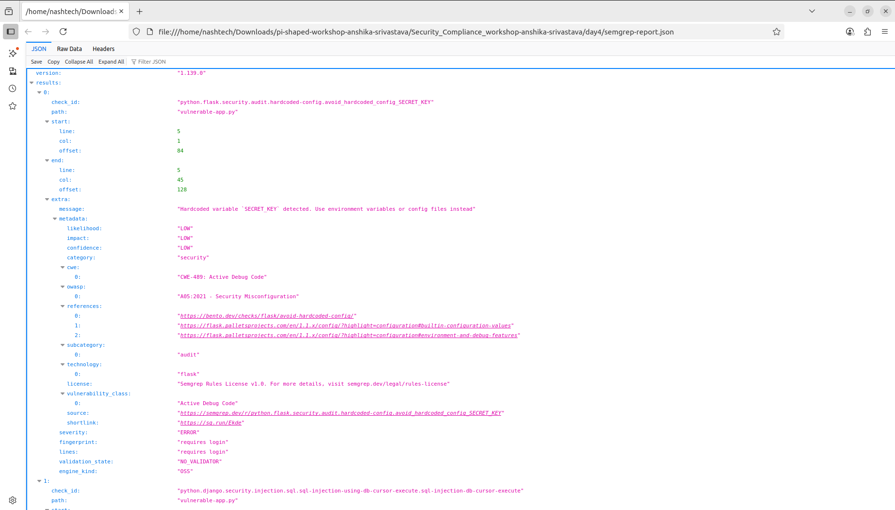
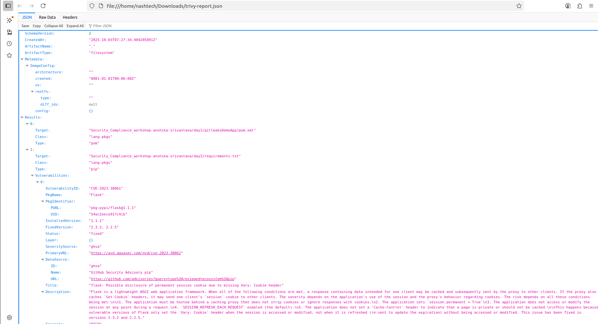
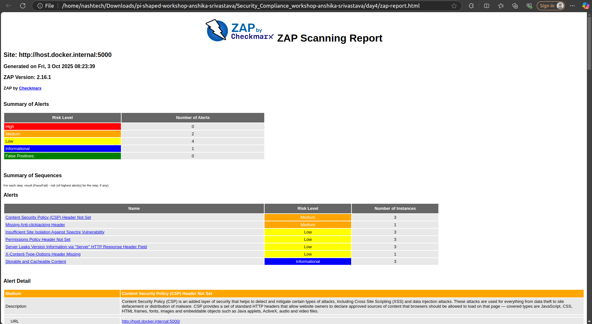

# CI/CD-Based DevSecOps Pipeline – Tools & Integrations Day4 

The pipeline uses **Bandit, Semgrep, Trivy, and OWASP ZAP** to detect issues and generate reports.

Key tools integrated in this pipeline include:

### Bandit for static code security checks
### Semgrep for detecting vulnerable or dangerous coding patterns
### Trivy for scanning dependencies and OS-level vulnerabilities
### OWASP ZAP for dynamic testing of running web applications (DAST)

---

## Local Setup & Execution Steps
```bash
pip install -r requirements.txt
```

###  Run Flask App
```bash
python3 vulnerable-app.py
```

### Run Security Scans Locally

### 1. Bandit – Detect insecure code
Bandit scans your Python code for security issues such as hardcoded secrets or unsafe functions.

```bash
pip install bandit

bandit -r . -f html -o bandit-report.html
```

### 2. Semgrep – Detect insecure coding patterns
Semgrep detects unsafe coding patterns in your Python code.

```bash
pip install semgrep

semgrep --config=auto . --json > semgrep-report.json
```

### 3. Trivy Installation & Scan
Trivy is used to detect vulnerable dependencies and OS-level vulnerabilities in the project.

```bash
sudo apt-get install wget gnupg
wget -qO - https://aquasecurity.github.io/trivy-repo/deb/public.key | gpg --dearmor | sudo tee /usr/share/keyrings/trivy.gpg > /dev/null
echo "deb [signed-by=/usr/share/keyrings/trivy.gpg] https://aquasecurity.github.io/trivy-repo/deb generic main" | sudo tee -a /etc/apt/sources.list.d/trivy.list
sudo apt-get update
sudo apt-get install trivy
trivy fs . --format json --output trivy-report.json
```

### 4. OWASP ZAP
Scan Running Flask App for Runtime Vulnerabilities

```bash
sudo docker run --rm --network host \
    -v "/home/nashtech//Downloads/pi-shaped-workshop-anshika-srivastava/Security_Compliance_workshop-anshika-srivastava/day4:/zap/wrk/" \
    -t ghcr.io/zaproxy/zaproxy:stable zap-baseline.py \
    -t http://127.0.0.1:5000 \
    -r zap-report.html
```

## GitHub Actions CI/CD Integration

* A workflow `.github/workflows/security-pipeline_Day4.yml` was created to run on every push to the `master` branch.
* Stages:

  * **Bandit scan** → generates `bandit-report.html`.
  * **Semgrep scan** → generates `semgrep-report.json`.
  * **trivy scan** → vulnerable dependencies
  * **OWASP ZAP scan (DAST)** → runs against the Flask app on `http://localhost:5000` and generates `zap-report.html`.
* All reports are saved as CI/CD artifacts for review.

---

## Screenshots / Artifacts

* **Bandit Report:** 
* **Semgrep Report:** 
* **Trivy Report:** 
* **Zap Report:** 

---

## Vulnerabilities Found

### 1. Vulnerable dependency

* **Impact:**
    Older Flask versions often have known security issues such as vulnerabilities in session handling, request validation, or CSRF protection.
* **Recommended Fix:**
    Upgrade to the latest stable version of Flask (For example, Flask 2.x+), which includes important security patches and performance improvements.

---

### 2. Use of `eval()`

* **Impact:**
  Remote code execution possible
* **Recommended Fix:**
  Avoid eval; use safe parsing or validation

---

## Core Concept Questions

### 1. a. Why is it important to run Trivy scans (for OS packages and dependencies) as part of the CI/CD pipeline instead of only scanning after deployment?
###    b. Why is it important to run security scans (SAST, dependency scanning, DAST) directly in the CI/CD pipeline instead of only during production?

- **Trivy scans in CI/CD:** Trivy scans your Docker image and filesystem for vulnerable packages, such as an outdated requests==2.19.0. Early detection enables you to upgrade to safer versions, reducing risk before deployment. 
- **SAST/DAST in CI/CD:** Static analysis tools like Bandit and Semgrep help find insecure coding patterns, such as unsafe use of eval() or hardcoded secrets, during the build process. Dynamic scanning with OWASP ZAP examines the running app to identify runtime vulnerabilities like Cross-Site Scripting (XSS) on sensitive endpoints. This multi-layered approach secures the app throughout development.

---

### 2. Tool Roles - How do Bandit, Semgrep, Trivy, and OWASP ZAP complement each other in the pipeline? Give one example of what each tool detects that the others do not.

**Bandit:** It is primarily used for static analysis of Python code. It inspects your Flask application for potential insecure constructs such as the use of eval(user_input). When Bandit identifies such issues, developers can improve the code by replacing unsafe functions with safer alternatives and by managing sensitive data like secrets through environment variables rather than hardcoding them.

**Semgrep:** It complements Bandit by scanning code patterns more broadly. It identifies insecure API usage or dangerous function calls in custom libraries that might not be easily caught by generic tools. When Semgrep flags such patterns, developers can refactor the codebase to adopt secure coding practices and prevent security flaws.

**Trivy:** It focuses on scanning your application dependencies and operating system libraries to detect known vulnerabilities. For example, Trivy may flag an outdated package like requests==2.19.0 with known security issues. Based on these findings, developers can update affected packages to secure, patched versions such as requests>=2.31.0, reducing threat exposure.

**OWASP ZAP:** It performs dynamic security testing by scanning the running Flask application to discover real-time vulnerabilities. It identifies runtime issues like reflected Cross-Site Scripting (XSS) attacks on endpoints such as /insecure. Upon receiving ZAP’s alerts, developers implement proper input validation, sanitize outputs, and add security measures to harden the application against such attacks.

---

### 3. Developer Actionability - If Trivy reports a HIGH severity vulnerability in a base image or Bandit flags hardcoded secrets, what should the developer or DevOps engineer do next?

- **HIGH severity Trivy vulnerability:** Base image or dependencies contain known vulnerabilities.
- **Action:** Update the Docker base image and dependencies to their latest secure versions.
  
- **Bandit flags hardcoded secrets:** Secret keys or passwords are found within the codebase.
- **Action:** Move secrets to environment variables or a secure secret management system like HashiCorp Vault to prevent exposure.

By adhering to these recommendations and leveraging automated security tools, developers can ensure that applications remain secure before deployment, supporting best practices in DevSecOps and reducing potential production risks.