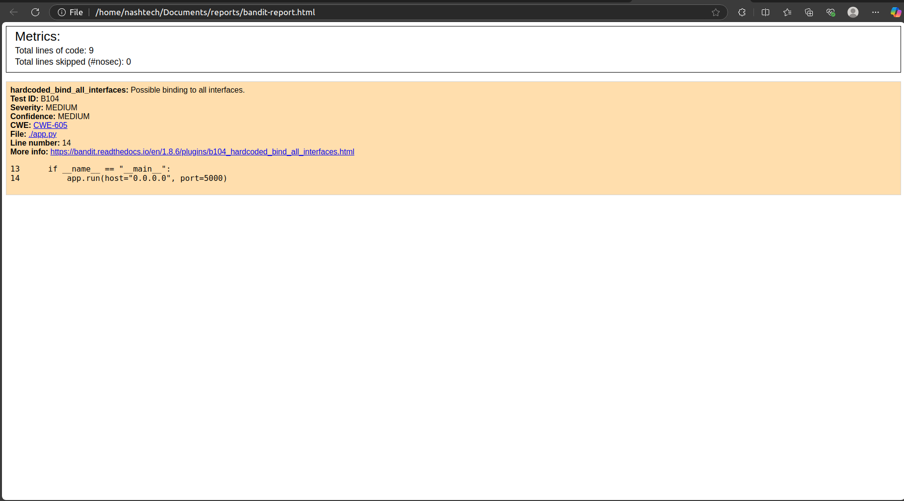
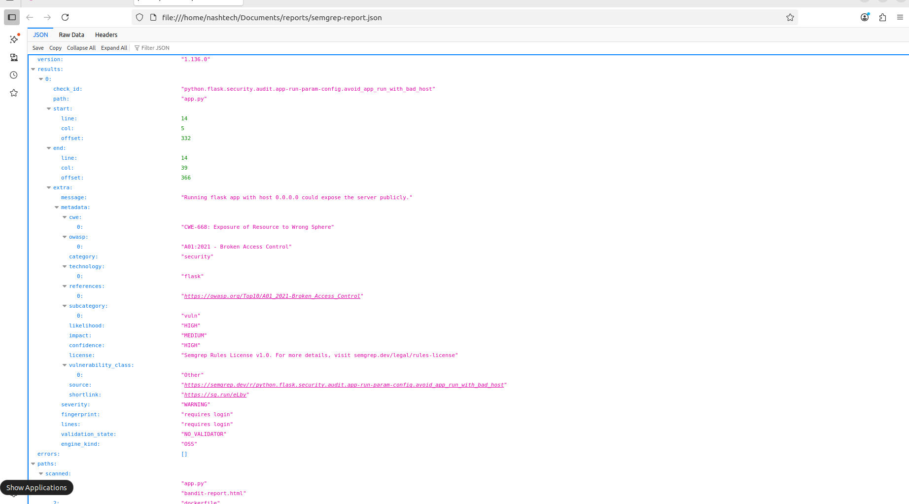
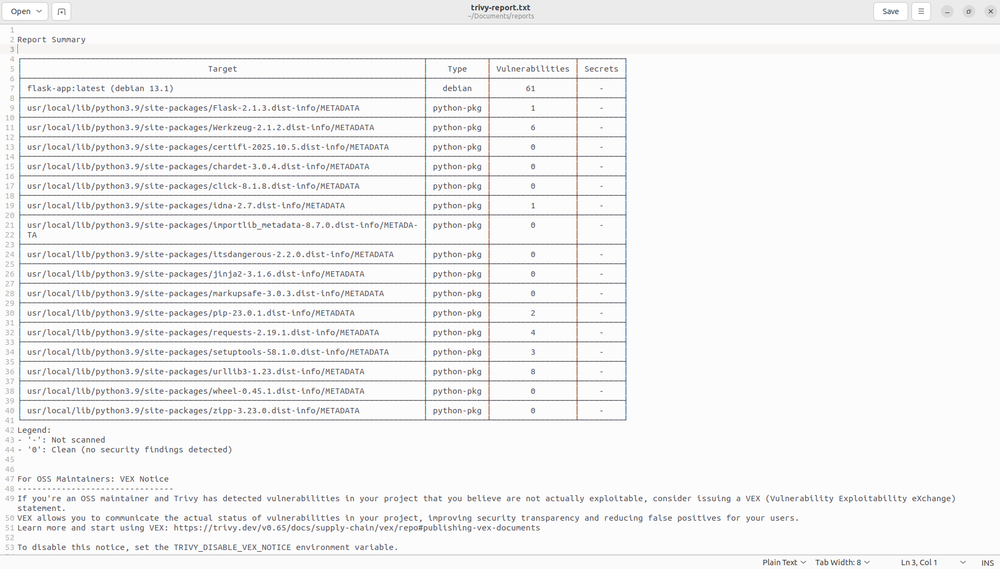
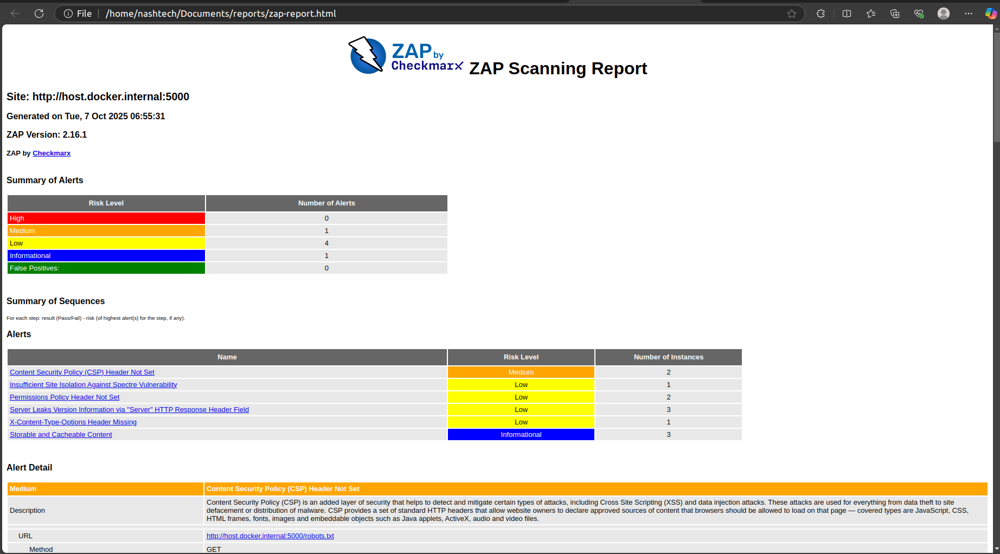
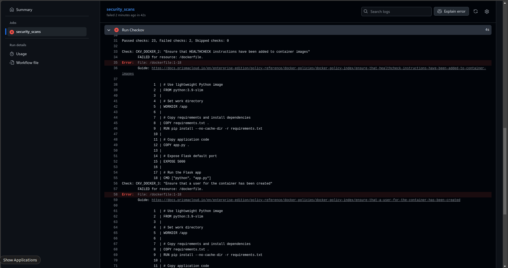
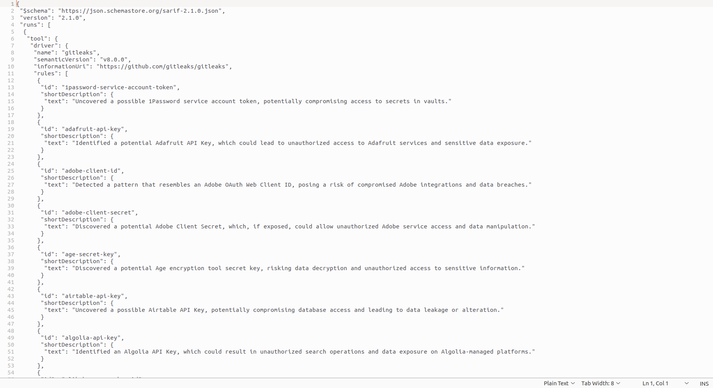

# Day 5: CI/CD Security & Compliance Pipeline

## Objective
Design and run a CI/CD pipeline that automatically scans a sample Python Flask application and its infrastructure for:

- Insecure code practices
- Vulnerable dependencies
- Misconfigured infrastructure (Terraform, Docker)
- Container/runtime vulnerabilities
- Leaked secrets or sensitive data

## Tools Integrated

| Tool        | Focus Area / Purpose |
|------------|---------------------|
| **Bandit** | Python code analysis for insecure coding patterns |
| **Semgrep** | Pattern-based static analysis for code security |
| **Trivy** | Dependency and Docker image vulnerability scanning |
| **Checkov** | Infrastructure-as-Code (Terraform) security scanning |
| **Gitleaks** | Secret detection (hardcoded keys/passwords) |
| **OWASP ZAP** | Dynamic Application Security Testing (DAST) for live app |

---

## Local Setup & Execution Steps
```bash
pip install -r requirements.txt
```

###  Run Flask App
```bash
python3 app.py
```
## Running the Application via Docker

### Prerequisites

- Docker & Docker Compose installed  
- Python 3.x installed (for local tests if needed)  

---

### Steps to Run Flask App in Docker

1. **Build the Docker image for Flask app**  
   ```bash
   docker build -t flask-app:demo ./app
   ```
2. **Run the Flask app container**
   ```bash
   docker run -d -p 5000:5000 --name flask-app flask-app:demo
   ```
3. **Verify the app is running**
   ```bash
   curl http://localhost:5000
   ```

## Demo Vulnerabilities Introduced

1. **Hardcoded secret** in `app.py`  
2. **Public S3/RDS bucket** in `infrastructure/main.tf`  
3. **Vulnerable Python dependency** in `requirements.txt`  
4. **Exposed Flask app** on default port (5000) for ZAP scan  

---

## CI/CD Pipeline (GitHub Actions Example)

### Stages & Tools

| Stage                  | Tool / Purpose | Artifact |
|------------------------|----------------|----------|
| Build                  | Install Python dependencies | - |
| SAST – Python Code     | Bandit → detect insecure Python code | `bandit-report.html` |
| SAST – Patterns        | Semgrep → detect insecure coding patterns | `semgrep-report.json` |
| Dependency Scan        | Trivy (Python) → detect vulnerable packages | `trivy-deps-report.json` |
| IaC Security           | Checkov → detect insecure Terraform config | `checkov-report.json` |
| Docker Image Scan      | Trivy (Docker image) → vulnerabilities/misconfigs | `trivy-docker-report.json` |
| Secrets / PII          | Gitleaks → detect secrets | `gitleaks-report.json` |
| DAST                   | OWASP ZAP → scan Flask app for vulnerabilities | `zap-report.html` |

_All reports are saved as pipeline artifacts._

---

## Screenshots / Artifacts

* **Bandit Report:** 
* **Semgrep Report:** 
* **Trivy Report:** 
* **Zap Report:** 
* **Checkov Report:** 
* **Gitleaks Report:** 


### Example Vulnerabilities

1. **Hardcoded Secret (`app.py`)**  
   - **Impact:** Attackers can retrieve API keys or passwords, compromising systems.  
   - **Recommended Fix:** Move secrets to environment variables or a secrets manager.  

2. **Public S3 Bucket (Terraform)**  
   - **Impact:** Sensitive data exposed to the public internet.  
   - **Recommended Fix:** Set `acl = "private"` and enable bucket policies with proper access control.  

**Demonstrated Fix:** Removed hardcoded API key from `app.py` → updated `bandit-report.html` shows no issues.

---

## Core Concept Questions

### How does each tool contribute to security & compliance?

| Tool       | Contribution |
|------------|-------------|
| Bandit     | Detects insecure Python code patterns |
| Semgrep    | Finds coding pattern violations / SAST issues |
| Trivy      | Detects vulnerable dependencies and insecure Docker images |
| Checkov    | Detects misconfigured Terraform / IaC resources |
| Gitleaks   | Finds hardcoded secrets or sensitive data |
| OWASP ZAP  | Identifies runtime vulnerabilities (XSS, SQLi, CSRF) |

---

### Critical Vulnerability Example

**Vulnerability:** SQL Injection in API endpoint  
- **Exploitation:** Malicious input manipulates database queries.  
- **Business Impact:** Data breach, GDPR fines, customer trust loss.  
- **Remediation:** Use parameterized queries, input validation, WAF rules, and automated tests.

---

### How to Prioritize Fixes

1. High severity / exploitable vulnerabilities first  
2. Compliance-critical issues (GDPR, HIPAA)  
3. Quick wins with minimal effort  
4. Exposed internet-facing services over internal systems

---

### Checkov Findings & Compliance Mapping

**Example:** `aws_s3_bucket.public_read`  
- **CIS AWS:** CIS 3.1 – Ensure S3 buckets are not publicly readable  
- **NIST:** AC-3 / SC-28 – Access control & encryption  
- **GDPR:** Prevents unauthorized exposure of personal data

---

### Why Both ZAP & Trivy Are Needed

| Tool       | Coverage | Unique Gap Filled |
|------------|----------|-----------------|
| Trivy      | Static scan (dependencies & Docker images) | Detects vulnerabilities before deployment |
| ZAP        | Runtime scan (live Flask app) | Detects runtime issues like XSS, SQLi that static scans cannot find |

**Conclusion:** Trivy secures the build artifact; ZAP validates the live application, covering the full DevSecOps lifecycle.